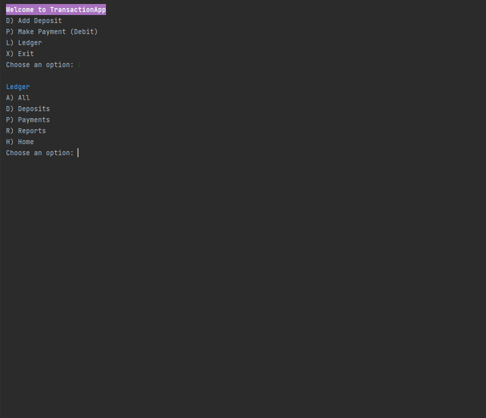

# Financial Tracker

A CLI application for financial management. The user is given options to add payments, make payments, and view ledgers. Within the ledgers screen, the user is also able to run pre-defined reports as well as a custom search report.


## Overview

- Setup

- Features

- Demo

- Future Work

- Thanks

## Setup
**Prerequisites**


Make sure Java and Maven are installed on your system.
You can check by running the following commands in your terminal:

```
java -version  
mvn -version
```
If they are not installed, download and install [Java](https://www.oracle.com/java/technologies/javase-downloads.html) and  [Maven](https://maven.apache.org/download.cgi).

**Clone The Repository**

In your terminal, navigate to the directory where you'll keep the project and clone this repository to your local machine. You can do this using the following command:
```
     git clone https://github.com/JalesiaGriffin/financial-tracker.git
```

## Features
- Add Deposit
- Add Payment
- Reports
  - Month to Date
  - Previous Month
  - Year to Date
  - Previous Year
  - By Vendor
  - Custom Search
- Transactions Ledger
- Deposit Ledger
- Payment Ledger

## Demo
### Home Screen

### Add Deposit

### Add Payment

### Ledger

### Deposit Ledger

### Payment Ledger

### Reports Menu


## Future Work

## Thanks