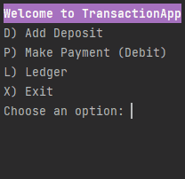
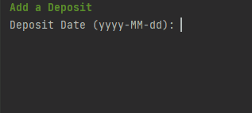
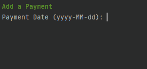
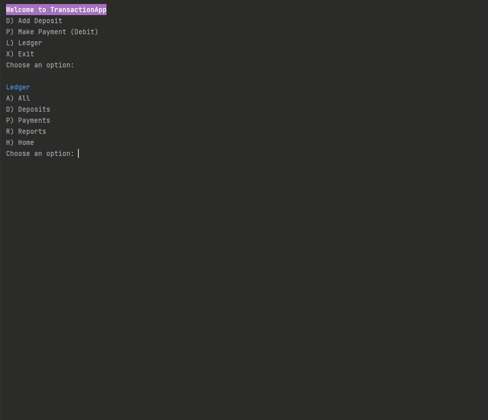
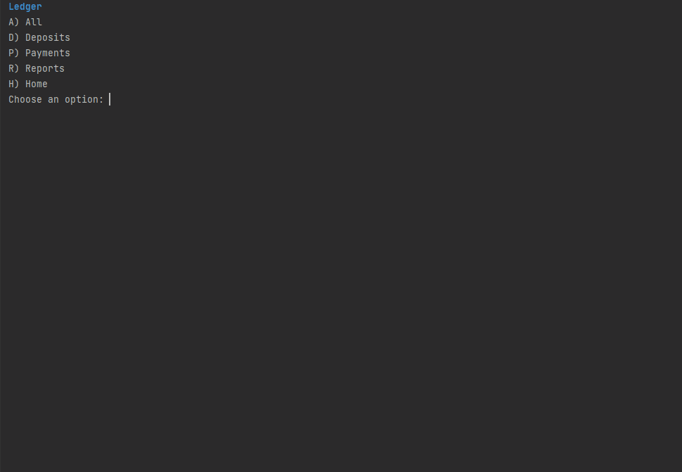
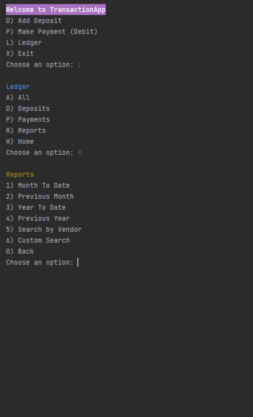

# Financial Tracker

A CLI application for financial management. The user is given options to add payments, make payments, and view ledgers. Within the ledgers screen, the user is also able to run pre-defined reports as well as a custom search report.

## Overview

- Demo

- Special Feature

- Setup

- Future Work

- Thanks

## Demo
### Home Screen

### Add Deposit

### Add Payment

### Ledger

### Deposit Ledger

### Payment Ledger

### Reports Menu

